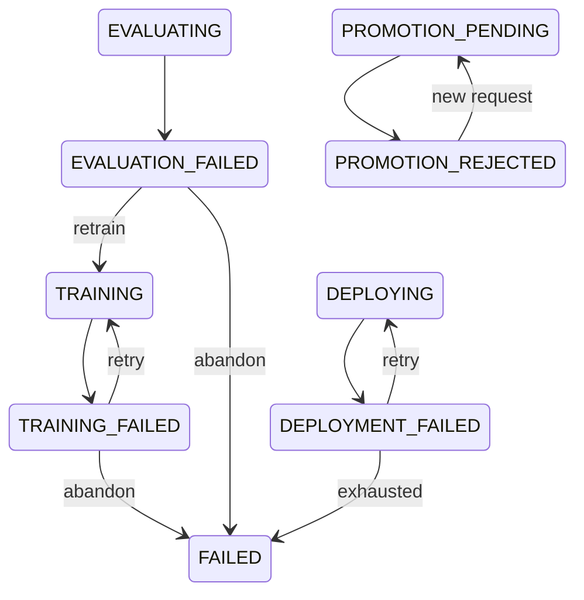
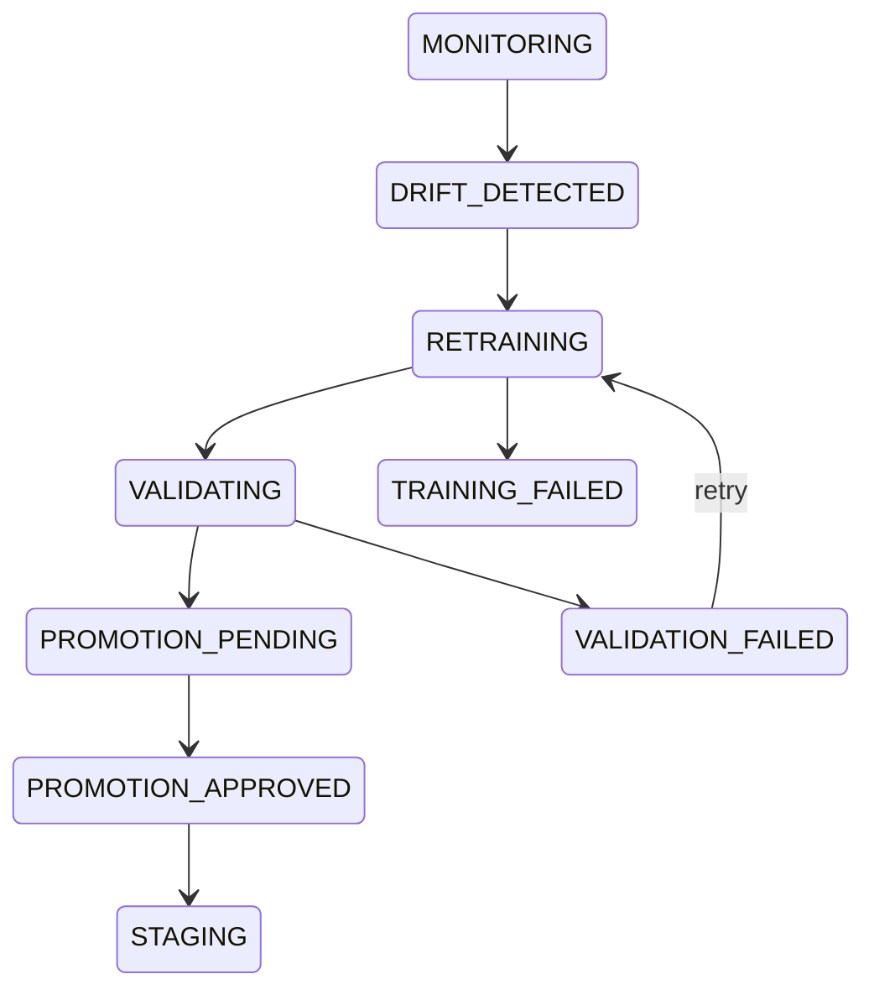
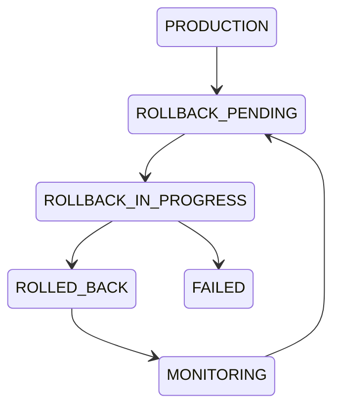
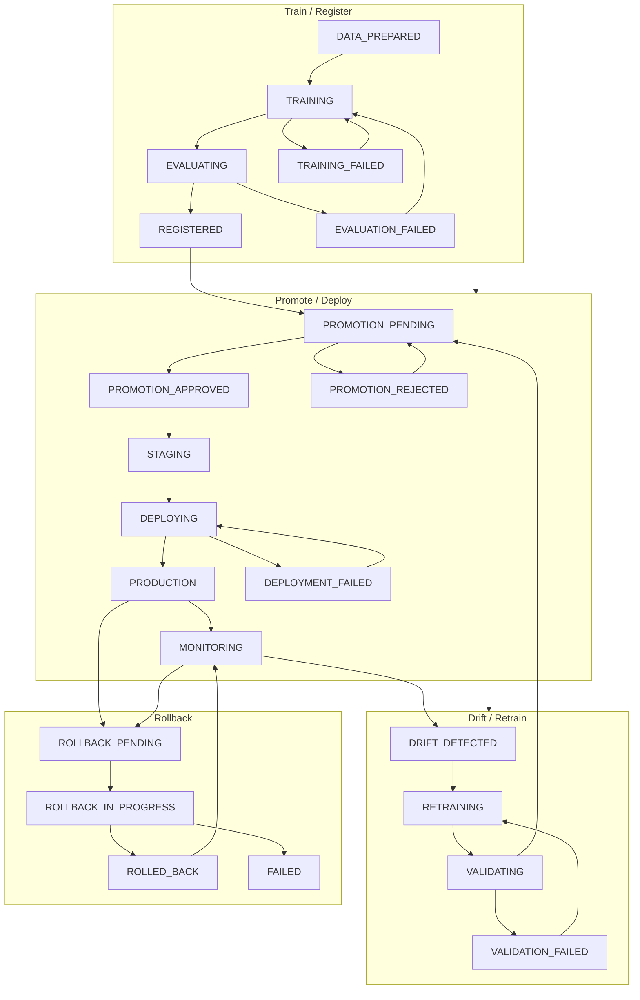

# Lifecycle State Machine Diagram

**Status:** Architecture Phase  
**Implementation Status:** Not Started  
**Session:** 1 - Lifecycle Runtime Semantics

Source-controlled diagram for Session 1 state machine. Canonical definitions: [lifecycle-state-machine.md](../architecture/lifecycle-state-machine.md), [transition-rules.md](../architecture/transition-rules.md).

---

## Implemented

No runtime behavior is implemented.

---

## Planned

Diagram generated from enforced transition matrix at implementation time (optional).

---

## Happy Path

```mermaid
stateDiagram-v2
    direction LR

    [*] --> DATA_PREPARED
    DATA_PREPARED --> TRAINING
    TRAINING --> EVALUATING
    EVALUATING --> REGISTERED
    REGISTERED --> PROMOTION_PENDING
    PROMOTION_PENDING --> PROMOTION_APPROVED
    PROMOTION_APPROVED --> STAGING
    STAGING --> DEPLOYING
    DEPLOYING --> PRODUCTION
    PRODUCTION --> MONITORING
```

---

## Failure Paths (Training / Eval / Deploy)

---

## Drift and Retraining Path

---

## Rollback Path

---

## Combined Overview

---

## Forbidden Edges (Not Shown)

These must be rejected by the control plane:

- `REGISTERED` → `PRODUCTION`
- `TRAINING` → `PRODUCTION`
- `DRIFT_DETECTED` → `PRODUCTION`
- `PROMOTION_REJECTED` → `DEPLOYING`
- `ROLLED_BACK` → `DEPLOYING` (without new approval)
- `FAILED` → `PRODUCTION`

See [transition-rules.md](../architecture/transition-rules.md).
